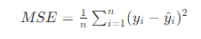
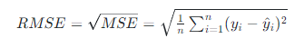
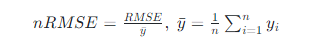
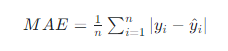

## Theory: Introduction to regression

In this topic, you will learn more about regression
problems. We will cover some real-world examples of 
regression and popular algorithms to solve them, as well
as the most commonly-used evaluation metrics for such
models.

#### 1. What is regression?
In supervised machine learning, as well as in statictics,
**regression** refers to numerical value prediction of 
continuous **Y** output from a number of predictor 
variables **X1**, **X2**, **Xm**.

The term itself was coined in the nineteenth century by a 
British statistician Francis Galton, who was studying the 
dependency between the heights of descendants of tall
ancestors tend to shrink, or **regress**, down to the average
human height.

Regression has a lot of real-world application. These
problems are very common in finance. Think of, for 
instance, predicting the exchange rates or the market
prices from those of a couple of days ago, as well as the 
values of other indicators.

Another example of a regression problem is predicting
the flight ticket prices. If you ever booked a flight, you
know that prices are formed dynamically by the airlines
and tend to change very often. Being able to predict the 
prices for the upcoming days is crucial for many booking 
services.

One more example of a regression problem is the time 
estimation for a delivery. For instance, each time you
order online from your favorite restaurant, the system
tells you when your order is going to be at your door.

The question is how can we solve all these problems?
Here are some of the most-used techniques.

#### 2. Solutions to regression problems
Arguably the simples approach to resolve regression
problems is **linear regression**, which models the **Y** output
as a linear combination of the **X1**, **X2**, **Xm** inputs:

**Y = αo + α1 ⋅ X1 + α2 ⋅ X2 + ... + αm ⋅ Xm**.

Fitting a linear regression model refers to finding the 
optimal values of the model coefficients **αo,α1, ..., αm.
Below is an example of a one-dimensional case, where
blue dots represent the data, and the red line
corresponds to the predictions produced by the linear
regression model ([the picture source](https://en.wikipedia.org/wiki/Linear_regression)):

Unfortunately, linear regression cannot be a solution to
every problem. In many cases, the dependency between
the observed features and the output is non-linear. So we 
need more sophisticated techniques.

One model that is employed quite often is the so-called
**regression tree**. This model produces the prediction for
the output variable by asking a series of questions about 
the values of the input features. Here is an example of a 
regression tree that predicts a vehicle's fuel consumption
based on its characteristics (see more in the 
[Classification and Regression Trees](http://cdn2.hubspot.net/hubfs/402067/PDFs/Classification_and_Regression_Trees.pdf) article):

Going from the top of the tree all the ways to its leaf nodes
by sequentially answering the questions like 'weight less
than 2512.5' and 'is a van type', we can obtain a prediction
for each particular car. Building a regression tree model
refers to deciding on which questions to ask.

What's the difference between a regression tree and a 
linear regression?

As you have just seen, the predictions of a linear
regression model lie on a straight line (or on a hyper-
plane in a multi-dimensional case). Regression tress, by
contrast, approximate the dependency between the input
features and the target with a step function (see more in 
the [Decision Tree Regression](https://scikit-learn.org/stable/auto_examples/tree/plot_tree_regression.html#sphx-glr-auto-examples-tree-plot-tree-regression-py) article by SCIKIT):

This helps to capture a more complex relationship
between the inputs and the output. In practice, however, a 
single regression tree is rarely enough to get a good
predictor for the output variable, as the model is still too
simplistic. Luckily, there are ways to combine several
regression tress in a **ensemble** that, in turn, produces
fairly accurate joint predictions.

Both linear regression and single regression trees are 
*interpretable* models, meaning that it's easy for humans
to explain where a prediction is coming from.

Other models can be used to solve regression problems,
for example, the **support vector regression** and **neural
networks**. Such models are more expressive than linear
regression or regression trees. At the same time, they are
not interpretable and are often referred to as *black box
models* because of that.

#### 3. Evaluation metrics
When solving a regression problem, you will most likely
want to try out different algorithms and compare them
with each other to determine the best one.

To do so, you will need to be able to evaluate the 
performance of a regression model.

In essence, you will need to assess how much the 
Y1, Y2, Yn predictions produced by your models are 
different from the true values of the output variables
Y1, Y2, Yn.

In machine learning, the most common way to do so is to
computer so-called **Mean Squared Error (MSE)**. MSE is 
the average squared deviation of the prediction from the 
true value, computer across all available examples:

The lower the MSE, the better the quality of the 
prediction.

Considering the squares of the difference between true 
and predicted values helps MSE give higher weight to 
larger errors. Indeed, small numbers get even smaller
when squared (e.g. 0.012 = 0.0001), so small prediction
errors will have a limited impact on the MSE score. Large
numbers, in turn, get much larger when squared (e.g.
1002 = 10000), so large errors will influence the MSE
score a lot.

In fact, MSE is used not only to evaluate regression
models but also to train them: optimal values of models
parameters are often determined by minimizing MSE.

The downside of MSE is that it's difficult to interpret.
Sometimes, a **Root Mean Squared Error (RMSE) is used
instead, which is nothing but a square root of MSE:

RMSE behaves similar to MSE and can be interpreted as 
an average distance between the prediction and the true 
point.

One disadvantage of RMSE is that, just like MSE, it's stil
scale-dependent. To facilitate the comparison between
datasets or models with different scales, the RMSE score
is often normalized, for example, by the average value of 
the target. The resulting score is referred to as the 
**normalized RMSE (nRMSE)**:

Another alternative is **Mean Absolute Error (MAE)**, which
is the average absolute deviation of the model's
predictions from the true values:

MAE is conceptually simpler and arguably easier to
interpret for people. Note that, unlike (R)MSE, MAE
doesn't penalize large errors more than the small ones.
So, if large prediction errors are particularly undesirable,
(R)MSE is a better choice.

Besides, the mathematical properties of the absolute
value function make it difficult to use MAE to find the 
optimal parameter values at the training phrase.

#### 4. Conclusions
- Regression is a sub-field of supervised ML which
  refers to predicting numerical outputs.
- Simple regression problems can be solved by Linear
  Regression models, while more difficult ones are 
  typically approached with ensembles of regression
  trees.
- The most typical evaluation metrics for regression
  models are MSE, RMSE, and MAE.
